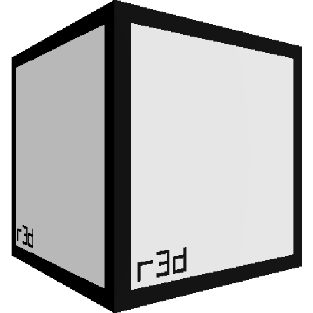

# R3D - 3D Rendering Library for raylib



R3D is a 3D rendering library designed to work with [raylib](https://www.raylib.com/). It offers features for lighting, shadows, materials, post effects, and more.

R3D is ideal for developers who want to add 3D rendering to their raylib projects without building a full rendering engine from scratch.

---

## Features

- **Material**: Uses raylib’s material system, just load a model and set its material maps, R3D handles the rest.  
- **Lighting**: Supports deferred lighting with directional, spot, and omni-directional lights.  
- **Shadow Mapping**: Real-time shadows with adjustable resolution and support for multiple light types.  
- **Skyboxes**: Loads and renders HDR/non-HDR skyboxes, with IBL support for scene lighting.  
- **Post-processing**: Includes SSAO, bloom, fog, tonemapping, color adjustment, FXAA, and more.  
- **Instanced Rendering**: Supports instance rendering with matrix arrays, an optional global matrix, and per-instance colors.  
- **Frustum Culling**: Provides easy shape tests (bounding boxes, spheres, points) for visibility in the scene frustum.  
- **Blit Management**: Renders at an internal resolution and blits the result to the main framebuffer or a render texture, with aspect ratio options.  

---

## Getting Started

R3D, relays on [raylib](https://www.raylib.com/) which is included in this repository as a submodule.

### Prerequisites

To build and use R3D, ensure you have the following dependencies installed:

- **raylib 5.5 or later**
  The library is included as an optional submodule. If **raylib 5.5** is already installed on your system, you can use R3D without cloning the submodule.
  🔹 *Note:* It is recommended to use **raylib 5.6-dev** ([commit c647d337](https://github.com/raysan5/raylib/commit/c647d337034585251d3d76d32093ac88a4c4ab82)), as it includes a fix for an issue affecting the default normal maps.

- **Python (>= 3.6)**
  Required for shader minification, which integrates optimized shaders into the library's binary.
  Already generated... TO CHECK

- **C Compiler**
  A compiler supporting C99 or later is necessary for building the project.

### Compatibility  

R3D requires an OpenGL 3.3+ compatible driver. OpenGL ES support is not yet available but is planned for future updates.

---

## Usage

### Initialize R3D

To initialize R3D, you need to specify the internal resolution in which it will render, as well as the flags that determine how it should operate. You can simply set them to '0' to start.  

Here is a basic example:

```c
#include <r3d.h>

int main()
{
    // Initialize raylib window
    InitWindow(800, 600, "R3D Example");

    // Initialize R3D Renderer with default settings
    R3D_Init(800, 600, 0);

    // Load a model to render
    Model model = LoadModelFromMesh(GenMeshSphere(1.0f, 16, 32));

    // Setup material with default values
    R3D_SetMaterialOcclusion(&model.materials[0], NULL, 1.0f);
    R3D_SetMaterialRoughness(&model.materials[0], NULL, 1.0f);
    R3D_SetMaterialMetalness(&model.materials[0], NULL, 0.0f);

    // Create a directional light
    // NOTE: The direction will be normalized
    R3D_Light light = R3D_CreateLight(R3D_LIGHT_DIR);
    R3D_SetLightDirection(light, (Vector3) { -1, -1, -1 });
    R3D_SetLightActive(light, true);

    // Init a Camera3D
    Camera3D camera = {
        .position = (Vector3) { -3, 3, 3 },
        .target = (Vector3) { 0, 0, 0 },
        .up = (Vector3) { 0, 1, 0 },
        .fovy = 60.0f,
        .projection = CAMERA_PERSPECTIVE
    };

    // Main rendering loop
    while (!WindowShouldClose()) {
        BeginDrawing();
        R3D_Begin(camera);
        R3D_DrawModel(model, (Vector3) { 0 }, 1.0f);
        R3D_End();
        EndDrawing();
    }

    // Close R3D renderer and raylib
    UnloadModel(model);
    R3D_Close();
    CloseWindow();

    return 0;
}
```

This example demonstrates how to set up a basic 3D scene using R3D:

1. Initializes a raylib window (800x600 pixels).  
2. Calls `R3D_Init()` to set up the R3D renderer with the default internal resolution (same as the raylib window).  
3. Loads and renders a simple cube model using `LoadModelFromMesh()`.  
4. Sets some material values, as raylib doesn't initialize them by default. `NULL` is used for the texture, meaning the current (default) texture is kept, then we assign the material map factor.  
5. Creates a directional light to illuminate the scene. R3D automatically normalizes the direction.  
6. Initializes a `Camera3D` to view the scene.  
7. Runs the main loop, rendering the cube and light until the window is closed.  
8. Closes the R3D renderer and raylib window properly.  

### Adding Lights

R3D supports several types of lights, each with its own behavior and characteristics. You can create and manage lights as shown below:

```c
R3D_Light light = R3D_CreateLight(R3D_SPOTLIGHT, 0);                    // Adds a spotlight, without shadows (zero parameter)
R3D_SetLightPositionTarget(light, (Vector3){0, 10, 0}, (Vector3){0});   // Set light position and target
```

The `R3D_CreateLight()` function takes one parameter: the light type, which remains constant for the light's lifetime.

R3D supports the following light types:

1. **R3D_DIRLIGHT (Directional Light)**:
   - Simulates sunlight, casting parallel rays of light in a specific direction across the entire scene.
   - Useful for outdoor environments where consistent lighting over large areas is required.

2. **R3D_SPOTLIGHT (Spotlight)**:
   - Emits a cone-shaped beam of light from a specific position, pointing toward a target.
   - Requires defining both the light's **position** and its **target** to determine the direction of the beam.
   - Spotlights include the following configurable parameters:
     - **Range**: Defines how far the spotlight reaches before fading out completely.
     - **Inner Cutoff**: The angle of the cone where the light is at full intensity.
     - **Outer Cutoff**: The angle where the light fades out to darkness.
     - **Attenuation**: Controls how the light intensity decreases with distance, enabling realistic falloff effects.

3. **R3D_OMNILIGHT (Omni Light)**:
   - A point light that radiates uniformly in all directions, similar to a light bulb.
   - Requires a **position** but does not use a direction or target.
     - **Range**: Determines the maximum distance the light affects objects before fading out.
     - **Attenuation**: Controls how the light intensity decreases with distance, enabling realistic falloff effects.

### Drawing a Model

To draw a model in the scene, use the `R3D_DrawModel()` methods. There are three possible variants:

- `void R3D_DrawModel(const R3D_Model* model)`
- `void R3D_DrawModelEx(const R3D_Model* model, Vector3 position, float scale)`
- `void R3D_DrawModelPro(const R3D_Model* model, Vector3 position, Vector3 rotationAxis, float rotationAngle, Vector3 scale)`

These functions work like raylib’s but differ internally. The only visible difference is that they don’t take a tint. This is due to implementation details, but you can still set the color in your material’s albedo map.

Otherwise, the types used are the same as in raylib, so you can load them directly with raylib, here’s an example:

```c
Model model = LoadModel("model.obj");
R3D_DrawModel(model, (Vector3) { 0 }, 1.0f);
```

---

## Additional Notes

- **Shadow Mapping**: Supports shadows for point, spot, and directional lights. When creating a light, you can specify a shadow map resolution. Shadows can still be disabled later using the `R3D_DisableLightShadow` function:  

```c
R3D_EnableLightShadow(light, 2048);     // Enable shadow mapping with a 2048x2048 shadow map resolution
R3D_DisableLightShadow(light, false);   // Disables the light; `false` keeps the allocated shadow map, while `true` destroys it
```

- **Material System**: R3D uses raylib’s materials but provides helper functions to simplify setup, as raylib doesn’t always initialize all values and configuring a model’s material can be repetitive.  

```c
Material material = LoadMaterialDefault();  // Provided by raylib  

// Sets the material's albedo with a texture (copied) and a tint.
R3D_SetMaterialAlbedo(&material, &myTexture, WHITE);

// Sets roughness; `NULL` keeps the existing texture.
// If none was set, R3D assigns a default one.
R3D_SetMaterialRoughness(&material, NULL, 1.0f);

// Metalness and roughness should be set together.
// By default, both are 0, similar to smooth plastic.
R3D_SetMaterialMetalness(&material, NULL, 0.0f);

// It’s recommended to set occlusion to `1` by default.
// Otherwise, shadowed areas may appear completely black.
// While it may seem logical for the value to be inverted,
// for standard formats, like GLB, `1` should be interpreted as no occlusion.  
R3D_SetMaterialOcclusion(&material, NULL, 1.0f);

// If no emission texture is assigned, R3D defaults it to black.
// Calling this function with `NULL` changes it to white, assuming you want emission.
// But don't panic! If the factor is `0`, the material won’t emit light.  
R3D_SetMaterialEmission(&material, NULL, RED, 3.0f);
```  

- **Post-processing**: Post-processing effects like fog, bloom, tonemapping or color correction can be added at the end of the rendering pipeline using R3D's built-in shaders.

---

## License

This project is licensed under the **Zlib License** - see the [LICENSE](LICENSE) file for details.

---

## Acknowledgements

Thanks to [raylib](https://www.raylib.com/) for providing an easy-to-use framework for 3D development!
